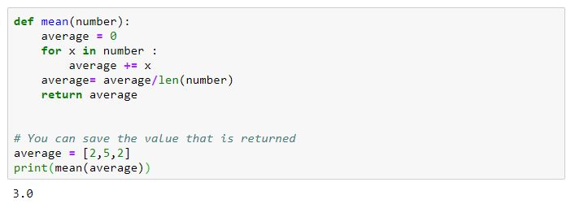

## Python Functions 
### Summary 
This repository shows the appropriate syntax for a function in Python. 
The function has more than one parameter and returns a number which is the average of 3 numbers. 
The name of the function is "mean". 
### Technical Details 
In order to run the code, it is required Visual Studio or Jupyter Notebook. 
### Screenshots 
FunctionOutput.JPG 
 
### Explanations 
The outcome is shown in screenshots for reference purpose of the public. 
